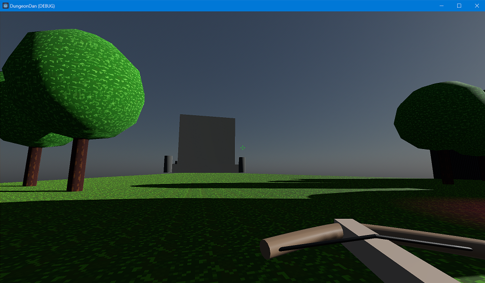

# DungeonDan (working title)

Dungeon Dan is a 3D cooperative multiplayer dungeon delving game where players must fight monsters and collect treasure in a procedurally generated dungeon before time runs out and the ceiling collapses! Think of it like Lethal Company with swords and horses instead of space ships and deadly company monsters.

This is very much still in the experimental stages as I learn how networked multiplayer works in Godot so watch this space as it grows!

(Disclaimer, this is VERY much a prototype right now. I am mainly using this as a way to explore game development. I wanted to figure out networked multiplayer basics and want to keep expanding on it!)
